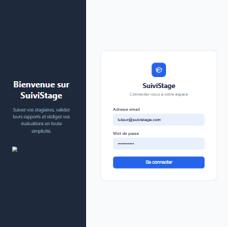
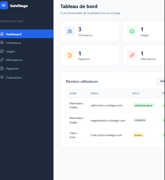
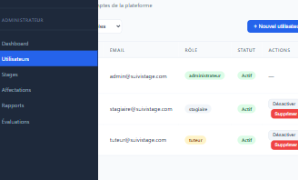
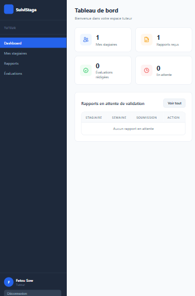
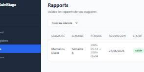
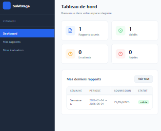
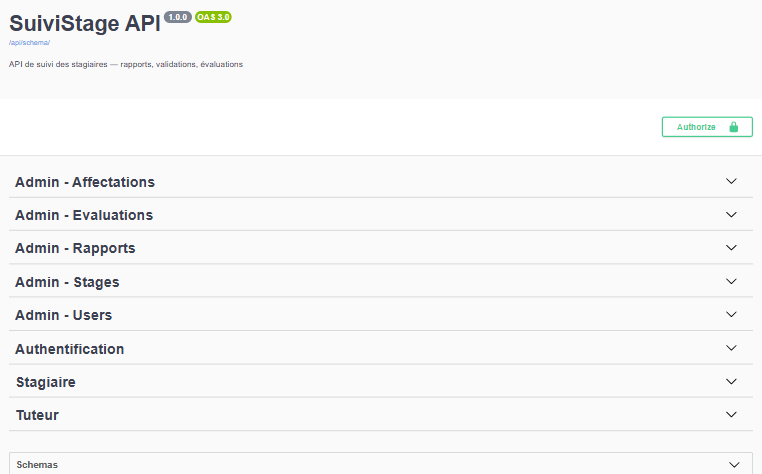

# SuiviStage

Plateforme de suivi des stagiaires en entreprise. Les stagiaires enregistrent leurs tâches hebdomadaires et leurs livrables. Les tuteurs valident les rapports d'activité et rédigent une évaluation de fin de stage.

---

## Stack technique

- **Backend** : Python 3.14 · Django 4.2 · Django REST Framework · JWT (PyJWT) · bcrypt
- **Frontend** : HTML · CSS · JavaScript (Vanilla)
- **Base de données** : MySQL
- **Documentation API** : drf-spectacular · Swagger UI
- **Versioning** : Git · GitHub

---

## Rôles

| Rôle | Accès |
|---|---|
| **Stagiaire** | Soumet ses rapports hebdomadaires et ses livrables, consulte son évaluation finale |
| **Tuteur** | Valide ou rejette les rapports, rédige l'évaluation finale |
| **Administrateur** | Gère les utilisateurs, les stages, les affectations, consulte tout |

---

## Règles métier

1. Un stagiaire ne peut soumettre qu'un seul rapport par semaine
2. Un rapport ne peut être modifié que s'il est en attente ou rejeté
3. Seul le tuteur assigné au stagiaire peut valider ses rapports
4. L'évaluation finale ne peut être rédigée qu'une seule fois par stage
5. Un stagiaire ne peut pas voir les rapports des autres stagiaires
6. Le tuteur ne voit que les stagiaires qui lui sont affectés
7. L'administrateur a accès total à toutes les données
8. Un rapport rejeté peut être corrigé et resoumis
9. Un rapport rejeté n'est jamais supprimé, il est conservé avec le commentaire du tuteur
10. Un compte désactivé ne peut plus se connecter

---

## Structure du projet

suivistage/
├── backend/                  ← Django REST Framework
│   ├── api/
│   │   ├── models.py         ← User, Stage, Affectation, Rapport, Livrable, Evaluation
│   │   ├── serializers.py    ← Validation + transformation JSON
│   │   ├── authentication.py ← Middleware JWT custom
│   │   ├── permissions.py    ← IsAdministrateur, IsTuteur, IsStagiaire
│   │   ├── urls.py           ← Routes API v1
│   │   └── views/
│   │       ├── auth_views.py
│   │       ├── stagiaire_views.py
│   │       ├── tuteur_views.py
│   │       └── admin_views.py
│   ├── suivi_stage/
│   │   ├── settings.py
│   │   └── urls.py
│   ├── .env.example
│   ├── manage.py
│   └── requirements.txt
└── frontend/                 ← HTML · CSS · JavaScript
├── index.html            ← Login
├── admin/
│   ├── dashboard.html
│   ├── users.html
│   ├── stages.html
│   ├── affectations.html
│   ├── rapports.html
│   └── evaluations.html
├── tuteur/
│   ├── dashboard.html
│   ├── stagiaires.html
│   ├── rapports.html
│   └── evaluations.html
├── stagiaire/
│   ├── dashboard.html
│   ├── rapports.html
│   └── evaluation.html
├── css/
│   ├── main.css
│   ├── auth.css
│   └── dashboard.css
└── js/
├── api.js
├── auth.js
└── ...

---

## Installation

### Prérequis

- Python 3.10+
- MySQL (XAMPP ou WAMP)
- Un navigateur moderne

### Backend

```bash
# Cloner le repo
git clone https://github.com/TON_USERNAME/suivistage.git
cd suivistage/backend

# Créer et activer l'environnement virtuel
python -m venv venv
venv\Scripts\activate        # Windows
source venv/bin/activate     # Mac/Linux

# Installer les dépendances
pip install -r requirements.txt

# Configurer les variables d'environnement
cp .env.example .env
# Modifier .env avec vos paramètres MySQL

# Créer la base de données MySQL
# Dans phpMyAdmin : créer une base "suivi_stage" en utf8mb4

# Appliquer les migrations
python manage.py migrate

# Lancer le serveur
python manage.py runserver 8002
```

### Frontend

```bash
# Ouvrir le dossier frontend avec Live Server dans VS Code
# ou double-cliquer sur frontend/index.html
```

---

## Endpoints API v1

| Méthode | URL | Accès |
|---|---|---|
| POST | `/api/v1/register` | Public |
| POST | `/api/v1/login` | Public |
| POST | `/api/v1/logout` | Authentifié |
| GET | `/api/v1/me` | Authentifié |
| GET | `/api/v1/stagiaire/rapports` | Stagiaire |
| POST | `/api/v1/stagiaire/rapports` | Stagiaire |
| GET | `/api/v1/stagiaire/rapports/<id>` | Stagiaire |
| PUT | `/api/v1/stagiaire/rapports/<id>` | Stagiaire |
| POST | `/api/v1/stagiaire/rapports/<id>/livrables` | Stagiaire |
| GET | `/api/v1/stagiaire/evaluation` | Stagiaire |
| GET | `/api/v1/tuteur/stagiaires` | Tuteur |
| GET | `/api/v1/tuteur/rapports` | Tuteur |
| POST | `/api/v1/tuteur/rapports/<id>/valider` | Tuteur |
| GET | `/api/v1/tuteur/evaluations` | Tuteur |
| POST | `/api/v1/tuteur/stagiaires/<id>/evaluation` | Tuteur |
| GET | `/api/v1/admin/users` | Admin |
| GET | `/api/v1/admin/users/<id>` | Admin |
| DELETE | `/api/v1/admin/users/<id>` | Admin |
| POST | `/api/v1/admin/users/<id>/toggle` | Admin |
| GET | `/api/v1/admin/stages` | Admin |
| POST | `/api/v1/admin/stages` | Admin |
| GET | `/api/v1/admin/stages/<id>` | Admin |
| PUT | `/api/v1/admin/stages/<id>` | Admin |
| DELETE | `/api/v1/admin/stages/<id>` | Admin |
| GET | `/api/v1/admin/affectations` | Admin |
| POST | `/api/v1/admin/affectations` | Admin |
| DELETE | `/api/v1/admin/affectations/<id>` | Admin |
| GET | `/api/v1/admin/rapports` | Admin |
| GET | `/api/v1/admin/evaluations` | Admin |

Documentation complète : `http://localhost:8002/api-docs/`

---

## Captures d'écran

### Page de connexion


### Dashboard Administrateur


### Gestion des utilisateurs


### Dashboard Tuteur


### Validation d'un rapport


### Dashboard Stagiaire


### Documentation Swagger


---

## Authentification JWT

Le frontend stocke le token JWT dans `localStorage` après la connexion.

```js
// Stockage après login
localStorage.setItem('token', data.token)
localStorage.setItem('user', JSON.stringify(data.user))

// Envoi à chaque requête
headers: {
  'Authorization': `Bearer ${token}`
}
```

Le backend vérifie le token via `JWTAuthentication` à chaque requête entrante.

---

## Gestion des erreurs HTTP

| Code | Signification |
|---|---|
| 200 | Succès |
| 201 | Ressource créée |
| 400 | Requête invalide |
| 401 | Non authentifié |
| 403 | Non autorisé |
| 404 | Ressource introuvable |
| 422 | Erreur de validation |

---

## Changelog

### v1.0.0
- Backend Django REST Framework complet
- Authentification JWT custom
- Permissions par rôle (stagiaire, tuteur, administrateur)
- 29 endpoints documentés avec Swagger UI
- Frontend HTML/CSS/JS branché sur l'API
- Toasts de notification
- Modal de confirmation avant suppression
- Badge sidebar rapports en attente
- Compte désactivé bloqué à la connexion

---

## Auteur

Heredia Koumba
Projet réalisé dans le cadre du cours TechnoWeb Back-End — L3 Informatique ISI.